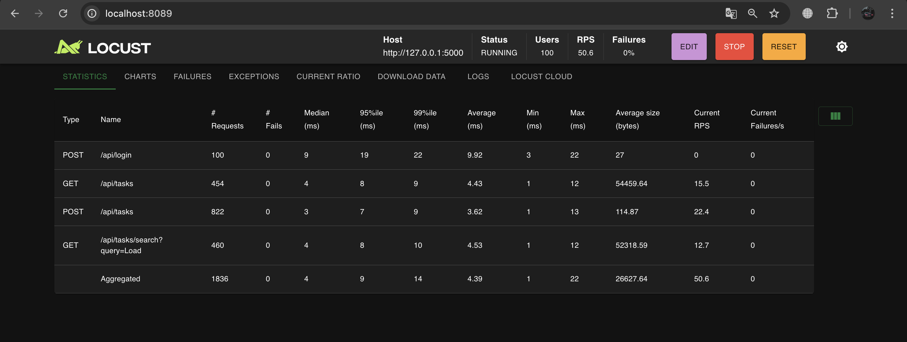
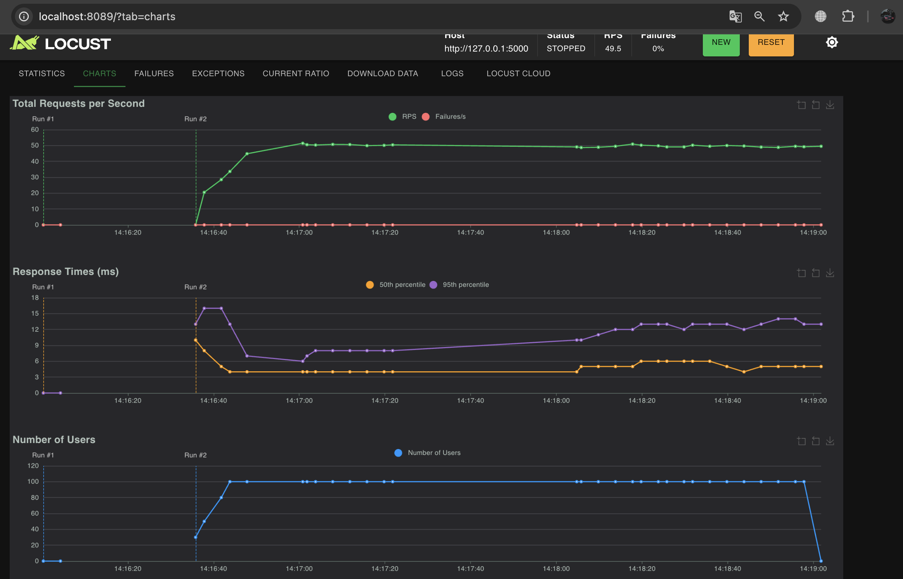
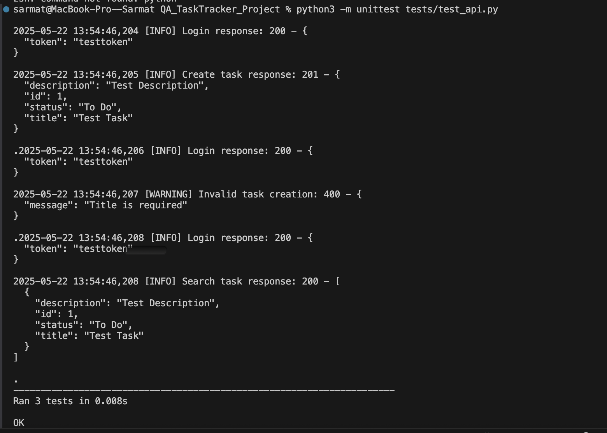

# QA Project: TaskTracker

Автоматические тесты, логирование и нагрузочное тестирование для TaskTracker API.

##  Состав проекта:
- `tests/test_api.py` — Unit-тесты на Python с использованием `unittest`
- `load_tests/locustfile.py` — нагрузочное тестирование с `Locust`
- `test_log.log` — лог-файл (генерируется автоматически)
- `requirements.txt` — зависимости

## Запуск тестов
```bash
python3 -m unittest tests/test_api.py
```

## Нагрузочное тестирование
```bash
locust -f load_tests/locustfile.py --host=http://example.com
```




## Unit тестирование



